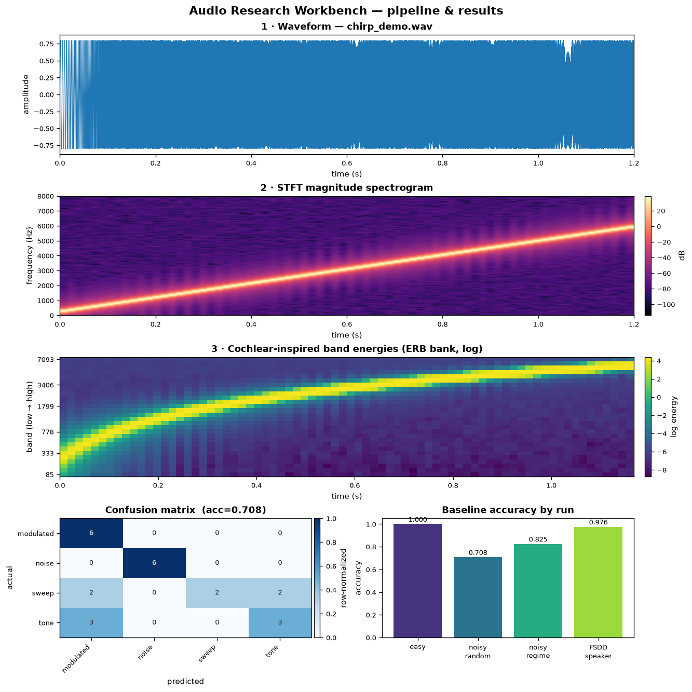

# Cochlear Audio Research Workbench

A small **.NET-first research-software workbench** for experimenting with audio
feature extraction, cochlear-inspired filter-bank features, and a reproducible
toy ML baseline.

## What this is

- A cross-platform C#/.NET command-line tool (`audio-research`) and a clean,
  tested core library.
- A transparent DSP pipeline: synthetic audio generation, WAV IO, framing,
  Hann windowing, a dependency-free radix-2 FFT/STFT, band energies, and a
  cochlear-inspired (ERB-spaced) triangular filter bank.
- A tiny, reproducible machine-learning baseline (k-NN) over extracted features,
  with three dataset modes: trivially-separable, a harder *noisy* synthetic set
  (overlapping classes + controlled SNR), and a frequency-regime generalization
  split.
- An optional real-data workflow: download the **Free Spoken Digit Dataset**
  (CC BY-SA 4.0) and run speaker/digit classification.
- Deterministic outputs (CSV features, JSON summaries, JSON experiment reports)
  suitable for examples, tests, and CI.

## What this is **not**

- Not a medical device, cochlear implant simulator, or clinical tool.
- Not a validated auditory model. The "cochlear-inspired" filter bank is a
  coarse engineering approximation, clearly documented as such.
- Not production-grade ML. The baseline is a learning/portfolio artifact.

See [docs/medical-disclaimer.md](docs/medical-disclaimer.md).

## Quick start

Requires the .NET SDK (developed and tested against **.NET 8.0 LTS**;
`dotnet --version` reported `8.0.127`).

```sh
# Build and test
dotnet build AudioResearch.sln -c Release
dotnet test AudioResearch.sln

# Run the CLI (via dotnet run)
dotnet run --project src/AudioResearch.Cli -c Release -- --help
dotnet run --project src/AudioResearch.Cli -c Release -- version
```

A typical end-to-end session:

```sh
DLL=src/AudioResearch.Cli/bin/Release/net8.0/AudioResearch.Cli.dll

# 1. Generate deterministic fixtures
dotnet "$DLL" generate tone  --freq 440 --seconds 1 --out samples/generated/tone_440hz.wav
dotnet "$DLL" generate noise --seconds 1            --out samples/generated/noise.wav
dotnet "$DLL" generate chirp --start 200 --end 4000 --seconds 1 --out samples/generated/chirp.wav

# 2. Inspect a file
dotnet "$DLL" inspect samples/generated/tone_440hz.wav

# 3. Extract features
dotnet "$DLL" features bands   samples/generated/tone_440hz.wav --out artifacts/tone-bands.csv
dotnet "$DLL" features summary samples/generated/tone_440hz.wav --out artifacts/tone-summary.json

# 4. Run the ML baseline (default: harder "noisy" synthetic dataset)
dotnet "$DLL" ml baseline --out artifacts/baseline-report.json
```

Optional: run the baseline on **real** audio (Free Spoken Digit Dataset):

```sh
dotnet "$DLL" dataset fetch fsdd                                  # ~12 MB, CC BY-SA 4.0, git-ignored
dotnet "$DLL" ml baseline --dataset data/fsdd/recordings --labels speaker
```

Example `inspect` output:

```text
File:         samples/generated/tone_440hz.wav
Sample rate:  16000 Hz
Channels:     1
Frames:       16000
Duration:     1 s
Peak:         0.8 (-1.9 dBFS)
```

Example `ml baseline` output (default noisy dataset):

```text
Dataset:   synthetic noisy, SNR 0..20 dB, 80 samples, 4 classes
Model:     k-nearest-neighbours (z-score standardized, Euclidean), k=3
Split:     56 train / 24 test (stratified-random, seed 42)
Accuracy:  0.708 on the held-out test set
```

Reproducible accuracy across the modes (seed 42, defaults):

| Command | Task | Accuracy |
| --- | --- | --- |
| `ml baseline --difficulty easy` | separable synthetic (4 classes) | 1.000 |
| `ml baseline` (default) | noisy synthetic, overlapping + SNR 0–20 dB | 0.708 |
| `ml baseline --split regime` | train low-freq → test high-freq | 0.825 |
| `ml baseline --dataset data/fsdd/recordings --labels speaker` | real FSDD, 5 speakers | 0.976 |
| `ml baseline --dataset data/fsdd/recordings --labels digit` | real FSDD, 10 digits (random split) | 0.941 |
| `… --labels digit --group-by speaker` | real FSDD digits, **speaker-independent** | 0.603 |

> The *easy* set hits 100% by construction — it shows the pipeline works. The
> *noisy* and *regime* numbers are deliberately lower (overlapping classes, added
> noise, train/test in different frequency bands), and the FSDD numbers come from
> real recordings. The digit accuracy drops from 0.941 to **0.603** under a
> speaker-independent split — the honest measure once the same speaker can no
> longer appear in both train and test. None of this is a medically meaningful
> task; the value is a tested, reproducible pipeline with honest evaluation.

## Visualization

An optional Python helper renders one figure from the CLI's artifacts: the
transformation pipeline (waveform → STFT spectrogram → cochlear band-energy
heatmap) and the ML results (confusion matrix + accuracy across runs).



It reads only the deterministic CSV/JSON the .NET CLI emits, so the figure
reflects the actual pipeline. Setup and commands: [experiments/README.md](experiments/README.md).

## Architecture

```text
src/
  AudioResearch.Core   pure domain logic: Audio, Dsp, Features, Experiments (no console IO)
  AudioResearch.ML     feature-vector abstractions + k-NN baseline (depends on Core)
  AudioResearch.Cli    command parsing, file IO, exit codes (depends on Core + ML)
tests/
  AudioResearch.Core.Tests   DSP / feature / WAV / ML algorithm tests (24)
  AudioResearch.Cli.Tests    CLI contract + exit-code tests (9)
```

`AudioResearch.Core` performs no console IO and only touches the filesystem via
explicitly passed streams/paths. The CLI owns all user-facing IO and exit codes
(`0` success, `1` handled error, `2` usage error). See
[docs/architecture.md](docs/architecture.md) and
[docs/signal-processing-notes.md](docs/signal-processing-notes.md).

## Tests

```sh
dotnet test AudioResearch.sln
```

48 deterministic tests cover WAV round-tripping, generator determinism, framing
and window endpoints, **golden DSP facts** (Parseval's theorem, bin-aligned sine
amplitude `A·N/2`, ERB filter-bank partition-of-unity, FFT inverse round-trip),
band-energy concentration, feature-schema stability, noise/augmentation SNR
correctness, and the ML baseline's accuracy and determinism. The FSDD filename
label parsing is covered offline; the network download itself is not exercised in
CI.

## Roadmap

Implemented in **v0.1** (this milestone): synthetic generators, WAV IO, DSP
primitives, cochlear-inspired features, CSV/JSON export, the k-NN baseline, a
harder noisy dataset + regime generalization split, and an optional real-dataset
workflow (FSDD fetch + speaker/digit classification).

Candidate **v0.2** work: microphone capture abstraction (opt-in), plots, ONNX
inference, a benchmark command, and a GitHub Pages
demo. These are not implemented yet and are not claimed.

## Medical disclaimer

This project is for software-engineering, signal-processing, and machine-learning
learning purposes only. It is not a medical device, cochlear implant simulator,
clinical tool, or validated auditory model. Any cochlear-inspired processing here
is an approximation for experimentation only. Full text:
[docs/medical-disclaimer.md](docs/medical-disclaimer.md).

## License

[MIT](LICENSE).
